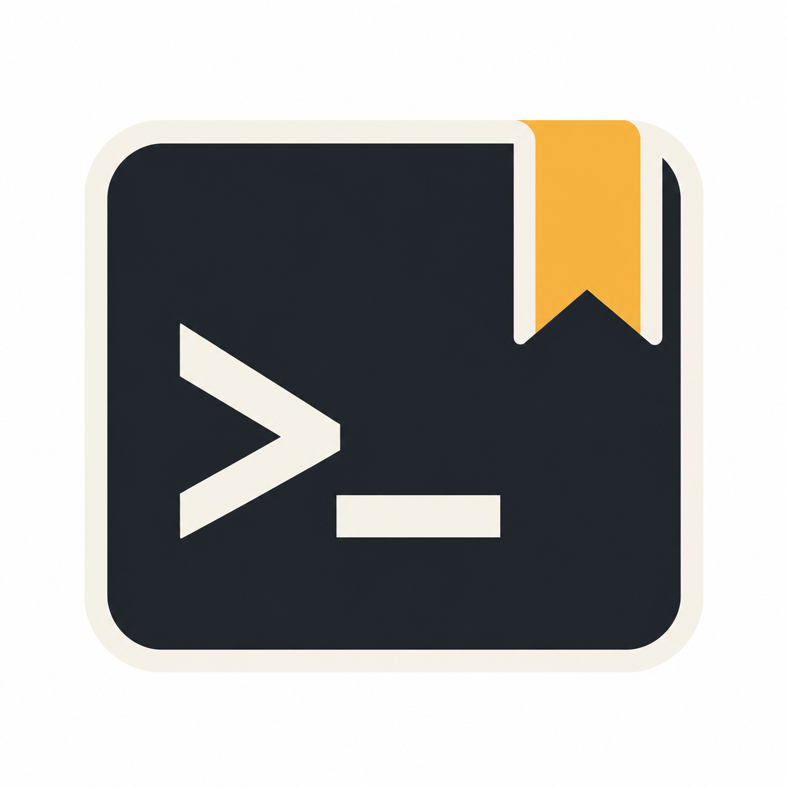

<p align="center">
  
</p>

# Codex Mem

**Вдохновлено [Claude Mem](https://github.com/thedotmack/claude-mem).**

[English version](README.md)

Локальная память для Codex: найти прошлые решения, сохранить проверенный опыт и восстановить контекст в следующей сессии. Самостоятельная реализация, предназначенная для Codex CLI и Codex desktop на macOS/Linux.

## Установить через агента

**Скопируйте этот prompt** и отправьте своему агенту:

```text
Установи Codex Mem на этом компьютере для Codex: https://github.com/alexandrbasis/codex-mem

Прочитай актуальный README репозитория, проверь требования и используй предусмотренный установщик. По возможности используй существующий клон или установленную копию; сохрани накопленную память, настройки и другие плагины.

При первой установке включи автоматический сбор для проекта, над которым я работаю, а не для папки исходников плагина. Если проект не открыт, оставь сбор выключенным и объясни, как выбрать проект. При обновлении сохрани существующую область сбора и исключения.

Проверь регистрацию плагина, MCP-инструменты, обнаружение и доверие hooks, а также фоновый обработчик наблюдений на Luna с reasoning medium. Сообщи, что удалось проверить и что ещё нужно сделать вручную, например разрешить hooks или открыть новую задачу Codex. Не объявляй автоматический сбор работающим без проверки.
```

## Текущая версия

Версия `1.7.0` сохраняет сообщённый расход токенов и длительность каждой попытки обработки наблюдений. Диагностика v2 различает текущую обработку, карантин неудачных заданий, блокировку сервиса и просроченную работу. Сохраняются возможности 1.6.0: компактные результаты поиска, история вокруг выбранной записи, восстановление очереди и обновление работающего сервиса. Обработчик использует Luna с reasoning `medium`. Сырой журнал доступен для явного просмотра и исключён из обычного поиска, автоматического контекста и семантического индекса. Граница нативной совместимости: Codex CLI `0.153.4`. Результаты проверок и установки приведены в [VERIFICATION.md](docs/VERIFICATION.md).

В отдельной таблице сохраняется до 64 КиБ входа и до 64 КиБ результата инструмента после удаления приватных блоков и распознаваемых секретов. Если поле больше, сохраняются начало и хвост с отметкой об обрезке внутри корректного JSON. Обработчик получает весь сохранённый текст, включая середину. Полные транскрипты и изображения не копируются.

Базовое хранилище использует Python 3.10+ и SQLite с FTS5. Для семантического поиска предусмотрено отдельное локальное окружение FastEmbed/ONNX Runtime на Python 3.10–3.13. Обработка наблюдений использует установленный Codex CLI с текущей авторизацией. Отдельный API-ключ не нужен.

## Установка

Из корня публичного репозитория:

```sh
git clone https://github.com/alexandrbasis/codex-mem.git
cd codex-mem
python3 scripts/codex-mem.py doctor
python3 scripts/install.py
python3 scripts/install.py --apply
```

Первая команда проверяет окружение. Вторая показывает изменения установки. Третья копирует плагин в `~/plugins/codex-mem`, добавляет одну запись в personal marketplace и вызывает `codex plugin add`. Существующие плагины сохраняются; перед изменением реестра создаётся резервная копия.

После установки откройте новую задачу Codex. Проверьте определения плагина через `/hooks` и разрешите их выполнение. Установка сама по себе не подтверждает доверие к hooks. MCP-инструменты доступны независимо от автоматического сбора после загрузки плагина в новую задачу.

Установщик сохраняет кэш прежних версий и перенаправляет их launchers на актуальную установленную версию. Открытые задачи продолжают работать через уже загруженные пути hooks; оригинальные launchers сохраняются в резервной копии. При обновлении работающий Codex Desktop может сохранить каталог прежней версии даже для новой задачи. Если она ссылается на старый, уже отсутствующий путь плагина, завершите активную работу и перезапустите приложение, затем повторите проверку. Успешная установка через CLI ещё не подтверждает обновление каталога уже запущенного приложения.

## Выбор проектов

По умолчанию автоматический сбор разрешён только для выбранных проектов; список изначально пуст. Включить проект:

```sh
python3 scripts/codex-mem.py config --scope selected --include-project /absolute/path/to/project
```

Укажите полный список в одном вызове: повторите `--include-project` для каждого пути. Переданный список заменяет предыдущий. Подкаталоги включённого пути тоже разрешены; отдельные worktree сохраняют отдельную историю.

Собирать во всех проектах, кроме исключений:

```sh
python3 scripts/codex-mem.py config --scope all --exclude-project /absolute/private/project
```

Оставить только явные команды сохранения:

```sh
python3 scripts/codex-mem.py config --scope manual
```

Пропускать инструменты по имени можно через `config --skip-tool TOOL_NAME`; повторяйте флаг для полного списка. Инструменты памяти и файлы памяти сессии исключаются автоматически. Приватный запрос закрывает захват последующих инструментов своей сессии до следующего публичного запроса.

Плагин не распознаёт все формулировки запрета на сохранение в обычной переписке. Для гарантированного отключения автоматического сбора используйте настройку `manual` или исключение проекта. Навык отдельно требует соблюдать пользовательские ограничения при записи заметок самим агентом.

## Навыки

В плагине два навыка:

| Навык | Когда нужен |
| --- | --- |
| [memory](skills/memory/SKILL.md) | Вспомнить причину решения, найти прошлое исправление с подтверждением, сохранить проверенный результат или объединить связанные заметки. Агент сначала ищет превью, затем читает выбранные записи и их источники. |
| [maintenance](skills/maintenance/SKILL.md) | Проверить работу памяти, выяснить причину задержки записей или устранить сбой. Навык проверяет базу, последние события, очередь, обработчик, индекс и регистрацию hooks, затем проверяет результат разрешённого исправления. |

Оба навыка имеют `allow_implicit_invocation: false`: вызывайте `$codex-mem:memory` и `$codex-mem:maintenance` явно. Хуки собирают наблюдения по ходу работы. `memory` помогает использовать эти сведения и сохранять важные выводы. `maintenance` обслуживает систему сбора, обработки и поиска.

Примеры: «Почему мы выбрали эту архитектуру?», «Запомни проверенную причину бага и исправление», «Проверь Codex Mem для этого проекта и объясни, что застряло в очереди».

Диагностику можно запустить из корня плагина:

```sh
python3 skills/maintenance/scripts/health_check.py --project /absolute/path/to/project
python3 skills/maintenance/scripts/health_check.py --all-projects --deep
```

Результат содержит JSON с метаданными. Диагностика сохраняет базу и настройки без изменений; `--deep` добавляет проверку целостности SQLite. Для другой папки данных передайте `--data-dir`. Доверие hooks и факт их выполнения проверяются отдельно; навык использует установленный host check для проверки регистрации. Диагностика не запускает модель, повторную обработку или исправления. Действия обслуживания имеют собственную область и последствия.

В отчёте v2 `in_progress` означает активное задание обработки, `quarantined` обозначает сохранённые неудачные задания, `blocked` появляется при явной блокировке планирования в сервисе, а `stale` указывает на истёкшую аренду задания или просроченную работу при остановленном обработчике. Историческая ошибка сама по себе не означает, что сервис заблокирован. Отчёт показывает время последней успешной обработки и возраст ожидающей работы.

## Работа в Codex

- «Найди, что мы уже выяснили об авторизации в этом проекте» — поиск коротких превью, затем чтение выбранных записей.
- «Запомни это решение и результаты проверки» — заметка с источником и подтверждением.
- «Собери краткий итог прошлой сессии, сохрани нерешённые вопросы» — объединение записей с сохранением ссылок на исходные.
- «Удали запись с ID …» — удаление выбранной записи из рабочей базы и поискового индекса.

Инструменты: `memory_search`, `memory_get`, `memory_timeline`, `memory_remember`, `memory_consolidate`, `memory_forget`, `memory_status`, `memory_get_tool_uses`. Каждый запрос к данным указывает абсолютный путь проекта. Поиск поддерживает совпадение слов, семантическое сходство и объединение этих результатов. Ответ инструмента сообщает использованный режим.

Поиск принимает повторяемые фильтры `--type`, `--concept`, `--file` до ранжирования во всех режимах. `tool-uses --project /absolute/path/to/project --limit 5` возвращает сохранённые входы и результаты; команды из этих данных не выполняются.

Начиная с 1.6.0, поиск и timeline в CLI/MCP возвращают компактные превью. В них остаются ID, выдержка, происхождение и сведения о замене записи. Полные narrative, facts и поля итогов сессии не дублируются. `--detail full` или MCP `detail="full"` возвращает прежние подробные метаданные превью. Полная запись, включая тело и `source_ids`, по-прежнему доступна через `get`/`memory_get`. Ранжирование и фильтры не меняются.

Чтобы прочитать события вокруг результата, подставьте его точный ID вместо `MEMORY_ID`:

```sh
python3 scripts/codex-mem.py timeline \
  --project /absolute/path/to/project \
  --anchor-id MEMORY_ID --before 3 --after 3
```

Окно включает выбранную запись с `is_anchor=true` и соседние события в хронологическом порядке. По умолчанию возвращается до 5 записей с каждой стороны; всего не более 100. `--session-id` дополнительно ограничивает сессию. Если ID отсутствует в выбранном проекте или сессии, результат пустой. В этом режиме размер задают `before` и `after`, а не `--limit`. Без якоря timeline возвращает последние события, начиная с новых. Сырые и заменённые записи доступны для проверки истории.

При обновлении управляемой установки installer пытается корректно перезапустить уже работающий сервис памяти и проверяет смену владельца и версию процесса. В результате `runtime_refresh.status="restarted"` подтверждает новый процесс, а `restart_pending` означает, что файлы установлены, но обновление процесса не подтверждено. Ранее остановленный сервис остаётся остановленным. Это отдельная проверка от обновления каталога плагинов в desktop.

Диагностика показывает расход обычных сессий и возраст последнего события; отдельный блок `observer_usage` содержит попытки обработки, длительность и покрытие учёта токенов. Недоступные данные не считаются нулевым расходом. Если sandbox запрещает проверку процесса, его состояние обозначается как `unknown`.

## Семантический поиск

Установить отдельное окружение и скачать закреплённую мультиязычную модель:

```sh
python3 scripts/semantic_setup.py --python python3.13
```

Понадобится около 300 МБ для файлов модели и дополнительное место для Python-пакетов. Загрузка происходит только по этой явной команде. Обычный поиск и индексация используют локальный CPU, без отправки текста заметок наружу. Launcher плагина автоматически использует подготовленное окружение.

Для существующих записей можно выполнить одну порцию индексации:

```sh
python3 scripts/codex-mem.py semantic index --project /absolute/path/to/project
python3 scripts/codex-mem.py search --project /absolute/path/to/project --query "почему платёж не прошёл" --mode hybrid
python3 scripts/codex-mem.py semantic status --project /absolute/path/to/project
```

`semantic index` возвращает число оставшихся записей `pending`. Повторите команду, пока оно не станет нулём, или добавьте разрешённый проект в очередь сервиса. Режим `auto` использует доступный семантический индекс и явно сообщает о переходе к поиску по словам. Явные `semantic` и `hybrid` требуют готовой модели. `lexical` работает без неё.

Модель `multilingual-e5-base` поддерживает русский и английский. Длинные записи разбиваются по токенам; вектор записи объединяет её части. Это сохраняет участие текста за первым фрагментом, но небольшая деталь длинной заметки может получить низкий вес. Исходные записи всегда доступны по ID. При удалении и объединении старые векторы исключаются из поиска.

## Что записывается

В разрешённых проектах hooks сохраняют ограниченные по размеру выдержки из запроса и финального ответа, метаданные значимых команд и очищенные входы и результаты инструментов. Изображения и файлы транскриптов не копируются. При запуске и после сжатия чата hooks возвращают ограниченный объём прошлого контекста.

После каждого сохранённого результата инструмента и завершённого ответа hooks добавляют проект в очередь и будят локальный сервис. Основная задача продолжает работу, не дожидаясь модели. Сервис последовательно обрабатывает небольшие порции наблюдений в новых сессиях `gpt-5.6-luna` с reasoning `medium`, затем обновляет локальный семантический индекс. Выбор модели основного треда на обработчик не влияет. Сервис сохраняет очередь на диске и ждёт без модельных вызовов, когда работы нет.

Обработчик получает только отредактированные наблюдения выбранного проекта. Для этой сессии запрашивается пустой список окружения, а подключённые MCP-серверы отключаются по отдельности. Это многоуровневая изоляция, а не универсальный переключатель для всех встроенных инструментов Codex. Наблюдение содержит тип, факты, объяснение, понятия и списки прочитанных и изменённых файлов. Для содержательной работы на `Stop` создаётся отдельный итог: запрос, исследование, выводы, выполненное и следующие шаги. Модель возвращает структурированные заметки; запись разрешена только после проверки результата и параметров запуска. Статус сохраняет ID сессии и хода, модель, reasoning и исходные записи. Перенаправление на другую модель считается ошибкой. Ответ ассистента остаётся утверждением, пока его не подтверждают источники.

Такая обработка использует лимиты учётной записи Codex. Явные `memory_remember` и `memory_consolidate` также доступны модели основного треда для пользовательских команд. Отключить автоматическую обработку, сохранив сбор выдержек:

```sh
python3 scripts/codex-mem.py config --no-processor-enabled
```

Для ручной обработки одной порции наблюдений используйте `process --project /absolute/path`. После ошибки исходные записи сохраняются, а неудачное задание блокируется до явного повтора. `status --project /absolute/path` показывает обработку наблюдений.

## Фоновая очередь

Сервис обрабатывает только проекты, разрешённые текущей настройкой автосбора: при `selected` это явно добавленные пути, при `all` — все проекты кроме исключений. Он каждый раз проверяет настройки автосбора. Исключённый проект не должен блокировать обработку остальных. Очередь хранит пути проектов и состояние работы; тексты остаются в SQLite. Запуск при входе в систему не устанавливается.

```sh
python3 scripts/codex-mem.py service status
python3 scripts/codex-mem.py service enqueue --project /absolute/path/to/project
python3 scripts/codex-mem.py service stop
python3 scripts/codex-mem.py service start
```

Остановка завершается после текущей ограниченной по времени операции; сохранённая очередь остаётся для следующего запуска. После разбора ошибки повторите заблокированную работу:

```sh
python3 scripts/codex-mem.py service retry --project /absolute/path/to/project
```

`config --no-processor-enabled` отключает модельную обработку, сохраняя возможность локальной индексации. `config --no-semantic-enabled` отключает автоматическую индексацию и семантический поиск. `config --no-service-enabled` возвращает прежнюю обработку одной порции непосредственно в асинхронном hook; остановить уже запущенный сервис можно командой `service stop`.

Память хранит IDs, время, проект, сессию и источник. При объединении записи-источники исключаются из обычного поиска, но остаются доступны по ID. Прошлые записи считаются историческими данными: актуальные факты нужно проверять снова.

## Расход токенов

Посмотреть сохранённый расход проекта:

```sh
python3 scripts/codex-mem.py usage status --project /absolute/path/to/project
python3 scripts/codex-mem.py status --project /absolute/path/to/project
```

В `usage status` поле `records` содержит учёт обычных сессий из JSONL, а отдельное поле `observer_usage` описывает обработку наблюдений. Этот блок также доступен в `status` проекта, MCP `memory_status` и диагностике. Флаг `--session-id` у `usage status` фильтрует только `records`; `observer_usage` по-прежнему охватывает весь проект. Два журнала не объединяются.

Обработчик сохраняет последний корректный итог расхода от app-server для своей новой сессии и хода. Повторные сообщения заменяют снимок, а не суммируются. У каждой повторной попытки есть отдельная запись, поэтому её сообщённый расход учитывается отдельно. Также сохраняются результат попытки и доступная длительность.

| Покрытие | Значение |
| --- | --- |
| `reported` | Получен корректный снимок расхода, нативный ход завершён. Это само по себе не означает, что результат прошёл проверку перед записью в память. |
| `partial` | Корректный снимок получен до прерывания или ошибки хода. Он учитывается отдельно от расхода завершённых ходов. |
| `unknown` | Число записей без пригодных данных расхода, в том числе при отсутствии или некорректности обновлений. Их счётчики остаются `null`. |
| `without_receipt` | Попытки задания без записи учёта, в том числе исторические. Их расход неизвестен. |

Отдельная таблица SQLite создаётся при записи первой попытки обработки. До её появления блок возвращает `unavailable`, что не означает бесплатную обработку. Группы моделей имеют `model_basis="requested_job_profile"`: это запрошенные модель и reasoning, а не независимое подтверждение того, какой backend обслужил неудачную попытку. Кэшированный вход уже входит во входные токены, reasoning уже входит в выходные; повторно складывать эти части не нужно.

Учёт описывает сохранённые попытки. Он не рассчитывает денежные затраты или общую экономию от памяти. Границы проверок приведены в [VERIFICATION.md](docs/VERIFICATION.md), источники протокола и сравнения в [UPSTREAM.md](UPSTREAM.md).

## Данные и управление

Папка данных: `~/.local/share/codex-mem`. Её можно изменить через `CODEX_MEM_HOME` или CLI-флаг `--data-dir`. Плагин не изменяет встроенную память Codex, `AGENTS.md`, настройки Claude Mem или его базу.

Содержимое блоков `<private>…</private>` и распространённые форматы токенов, паролей и ключей редактируются перед сохранением. Это фильтр известных шаблонов, а не гарантия распознавания любых секретов. В папку данных следует допускать только доверенные локальные процессы. Изоляция проектов защищает от случайного смешивания запросов, но не заменяет права операционной системы.

```sh
python3 scripts/codex-mem.py status
python3 scripts/codex-mem.py backup /absolute/path/codex-mem-backup.sqlite
python3 scripts/codex-mem.py prune --days 90
```

`prune` удаляет старые записи из всех проектов. Резервные копии и уже отправленный в чат контекст остаются отдельными копиями данных. Проверьте срок хранения перед запуском.

Учёт обработчика хранит только служебные метаданные: ID задания и попытки, ID сессии и хода обработчика, счётчики и длительность. Запросы и ответы модели в эту таблицу не записываются. Метаданные остаются с заданиями обработки после удаления записей памяти через `forget` или `prune` и входят в резервные копии базы.

## Импорт Claude Mem

Импорт запускается отдельно и требует точного имени проекта в старой базе:

```sh
python3 scripts/codex-mem.py import-claude \
  --database /absolute/path/claude-mem.db \
  --legacy-project exact-old-project-name \
  --project /absolute/path/to/project
```

Без `--apply` команда показывает предварительный результат. Для записи повторите её с `--apply`. Исходная SQLite-база открывается только для чтения. Повторный импорт пропускает уже перенесённые записи. Неизвестная схема останавливает импорт; автоматического обхода всех проектов нет.

## Проверка и удаление

```sh
python3 -m unittest discover -s tests -v
python3 scripts/codex-mem.py doctor
codex plugin list --marketplace personal --json
```

`doctor` проверяет локальные файлы и возможности Python/SQLite; статус доверия hooks нужно проверять в Codex. Ошибка памяти не должна блокировать основную задачу или запускать бесконечные повторные попытки.

Для удаления используйте `codex plugin remove codex-mem@personal` (имя marketplace напечатано установщиком). База данных остаётся на диске. Автоматизацию можно временно остановить настройкой `config --no-capture-enabled` или переменной `CODEX_MEM_DISABLED=1` в окружении процесса Codex.

Источники и отличия от Claude Mem описаны в [UPSTREAM.md](UPSTREAM.md). Границы проверки приведены в [VERIFICATION.md](docs/VERIFICATION.md).

Прямое сравнение качества и расхода Claude и Luna остаётся непроведённым. Новый учёт не восстанавливает отсутствующие исторические данные и не доказывает общую экономию системы памяти.
